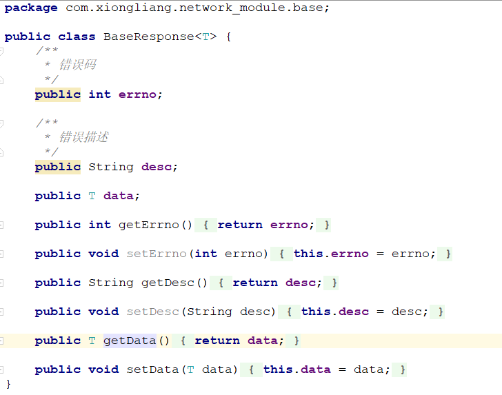
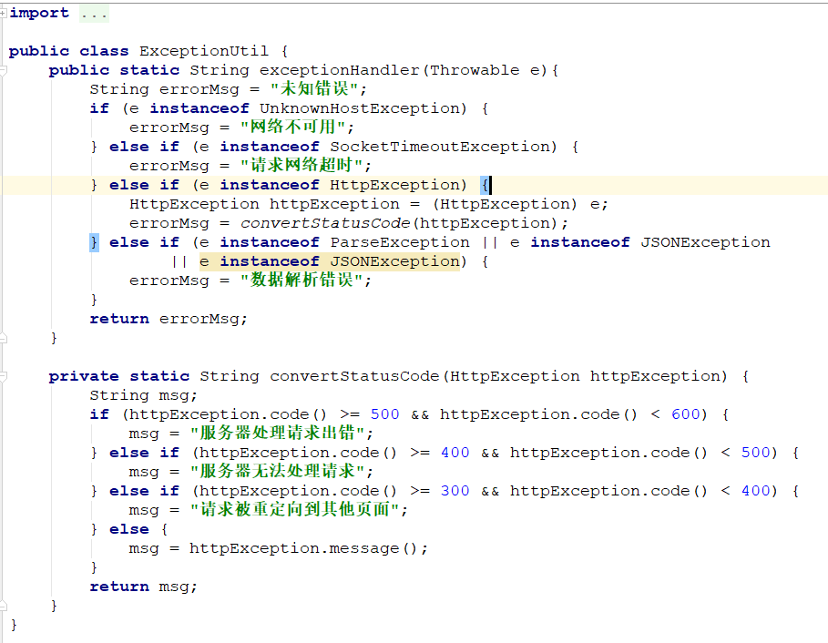
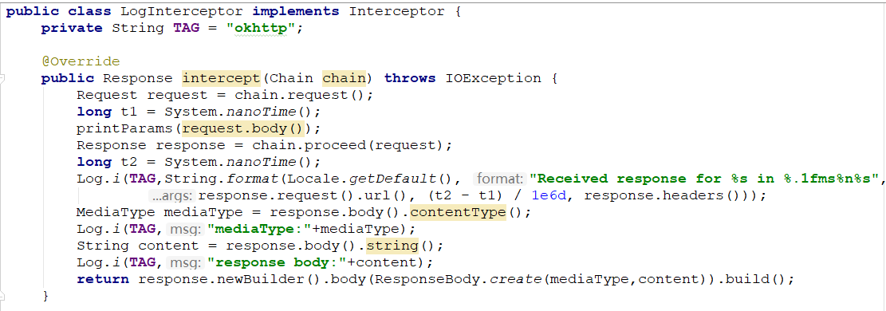

## 概述
基于Retrofit + RxJava封装的网络请求库

## 环境配置
retrofit网络请求框架   `com.squareup.retrofit2:retrofit:2.5.0`
retrofit添加Json解析返回数据  `com.squareup.retrofit2:converter-gson:2.5.0`
retrofit添加Rxjava支持  `com.jakewharton.retrofit:retrofit2-rxjava2-adapter:1.0.0`
rxjava框架  `com.trello.rxlifecycle2:rxlifecycle-components:2.1.0`

## 封装介绍
返回类封装:
使用泛型封装返回数据，抽取公共数据，减少重复工作

错误码统一处理:
对HttpException，UnKownHostException,SocketTimeOutExcetoion,ParseException进行处理

网络请求日志打印：
通过给Retrofit 添加拦截器实现

